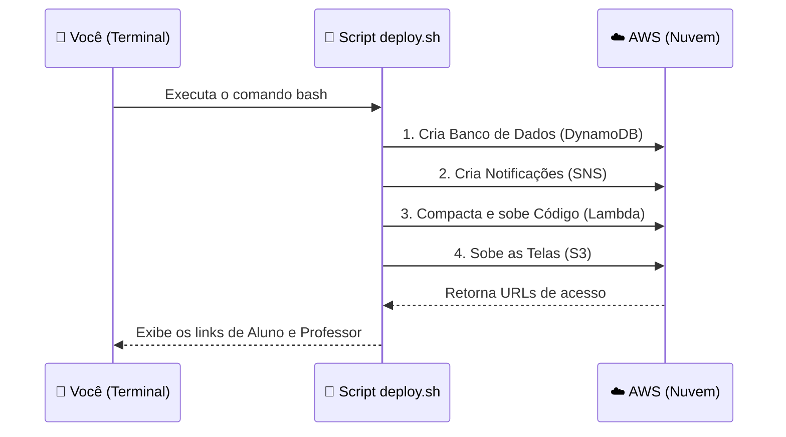

# 🚀 Guia de Deploy (Instalação)

Este guia foi feito para quem está fazendo seu primeiro deploy na nuvem AWS. Siga cada passo com calma.

---

## 📋 Pré-requisitos
Antes de começar, você precisa:
1.  **Conta AWS** ativa (estamos usando a Sandbox do Vocareum).
2.  **AWS CLI** configurado (é a ferramenta que usamos para falar com a AWS pelo teclado).
3.  **Node.js** instalado no seu computador.

---

## 🛠️ Passo a Passo

### Passo 1: Preparar o Terreno
Abra o seu terminal (Prompt de Comando ou PowerShell) na pasta do projeto e instale as dependências:

```bash
cd lambda
npm install
cd ..
```
*O que isso faz?* Baixa as "peças" (bibliotecas) que o nosso código precisa para funcionar.

### Passo 2: Rodar o Script Mágico
Nós criamos um script que faz todo o trabalho pesado para você: criar o banco de dados, configurar o site e subir o código.

Execute:
```bash
bash infrastructure/deploy.sh
```

**O que vai acontecer?**
1.  **Criação do Banco (DynamoDB)**: Onde as dúvidas serão salvas.
2.  **Criação do Cérebro (Lambda)**: Onde nossa lógica de IA (Amazon Comprehend) vai rodar.
3.  **Configuração do Site (S3)**: Onde seu site será hospedado.
4.  **Configuração da API**: O script vai te dar um link (URL) no final.

---

## 📊 Como o Deploy funciona? (Visual)



---

## ✅ Como saber se deu certo?

Ao final do script, você verá algo assim:
*   **Aluno URL**: `http://smartclass-qa-....s3-website-us-west-2.amazonaws.com/aluno/`
*   **Professor URL**: `http://smartclass-qa-....s3-website-us-west-2.amazonaws.com/professor/`

**Ação Importante**: 
Abra o link do **Professor** primeiro, e clique no botão **"🔇 Ativar Som"** para que você possa ouvir quando as dúvidas chegarem.

---

## ❌ Deu erro? (Solução de Problemas)
*   **Access Denied**: Verifique se você está logado na AWS corretamente (`aws sts get-caller-identity`).
*   **Região incorreta**: O script usa por padrão `us-west-2`. Certifique-se de que seu laboratório está nessa região.
