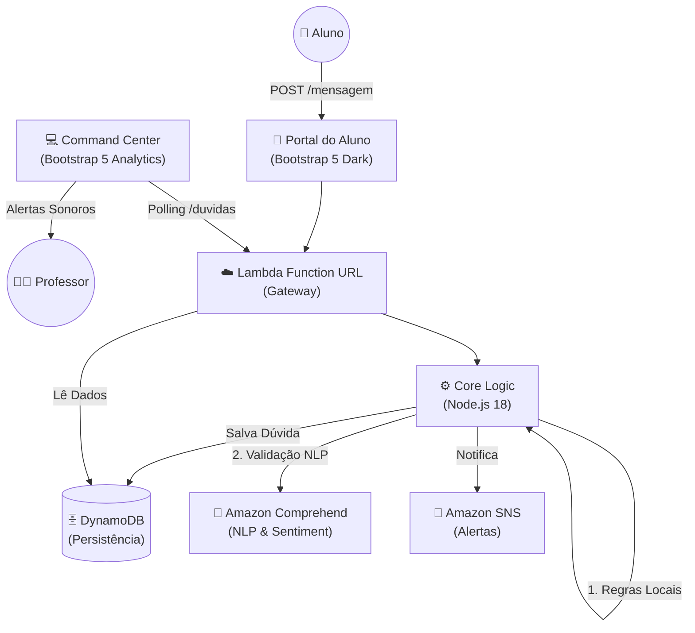

# 🎓 Smart Class Q&A

> **O que é este projeto?** Imagine uma sala de aula online onde os alunos enviam centenas de mensagens. O professor não consegue ler tudo. Nosso sistema funciona como um "filtro inteligente" que separa o que é dúvida técnica do que é interação social, alertando o professor e permitindo que ele foque no que realmente importa: **ensinar**.

---

## 🌟 Status Atual: Fase 2 (Polished & Functional)
O projeto evoluiu de um protótipo simples para uma aplicação robusta e visualmente profissional.

### ✅ Novas Funcionalidades
*   **Design Profissional**: Interfaces migradas para **Bootstrap 5** com tema escuro (Glassmorphism), totalmente responsivas e livres de emojis amadores.
*   **IA Aprimorada**:
    *   **Classificação Híbrida**: Combina regras léxicas rigorosas com análise de sentimento e extração de entidades do **Amazon Comprehend**.
    *   **Blacklist Inteligente**: O sistema agora entende contexto. "Não entendi" é bloqueado se for vago, mas "Não entendi o Lambda" é aprovado.
    *   **Feedback Loop**: O professor pode sinalizar "Falso Positivo" (Não é dúvida), ajudando a calibrar o sistema.
*   **UX do Aluno**:
    *   **Modal de Orientação**: Se o aluno envia uma pergunta vaga, um modal bloqueia a tela orientando-o a adicionar mais detalhes técnicos.
*   **Dashboard do Professor**:
    *   **Centro de Comando**: Métricas de IA em tempo real (Acurácia, Confiança, Fallbacks).
    *   **Top Alunos**: Identifica os alunos mais participativos (maior volume de dúvidas).
    *   **Auditoria**: Visualização clara do motivo da classificação ("🤖 Motivo: Termo técnico 'EC2' encontrado com sentimento negativo").

---

## 🏗️ Arquitetura do Sistema

O sistema é **Serverless**, garantindo custo zero quando ocioso e escala infinita.

---

## 📖 Glossário Técnico

*   **Frontend**: HTML5, CSS3, Bootstrap 5, Bootstrap Icons, Vanilla JS.
*   **Backend**: Node.js (AWS Lambda), AWS SDK v3.
*   **Banco de Dados**: Amazon DynamoDB (NoSQL).
*   **IA**: Amazon Comprehend (DetectSentiment, DetectKeyPhrases).
*   **Infra**: Serverless Framework (conceitual) / Shell Scripts manuais.

---

## 🛠️ Instalação e Uso

Para implantar este projeto na sua conta AWS, consulte o guia detalhado em: [**DEPLOY.md**](DEPLOY.md).

### Scripts Disponíveis
*   `tests/test-classifier.js`: Testa a lógica de classificação local.
*   `tests/test-filters.js`: Valida casos de borda e blacklist contextual.
*   `infrastructure/deploy.sh`: (Opcional) Script utilitário para deploy simplificado.

---

## 📊 Roadmap & Progresso

- [x] **Fase 1: MVP** (Protótipo funcional, IA básica).
- [x] **Fase 2: Refinamento** (UI Bootstrap, Modal de Aviso, Blacklist Contextual, Métricas IA).
- [ ] **Fase 3: Inteligência Avançada** (Integração com LLM/Claude para respostas automáticas, Persistência de Feedback para retreino).

---
&copy; 2025 Smart Class Q&A System
