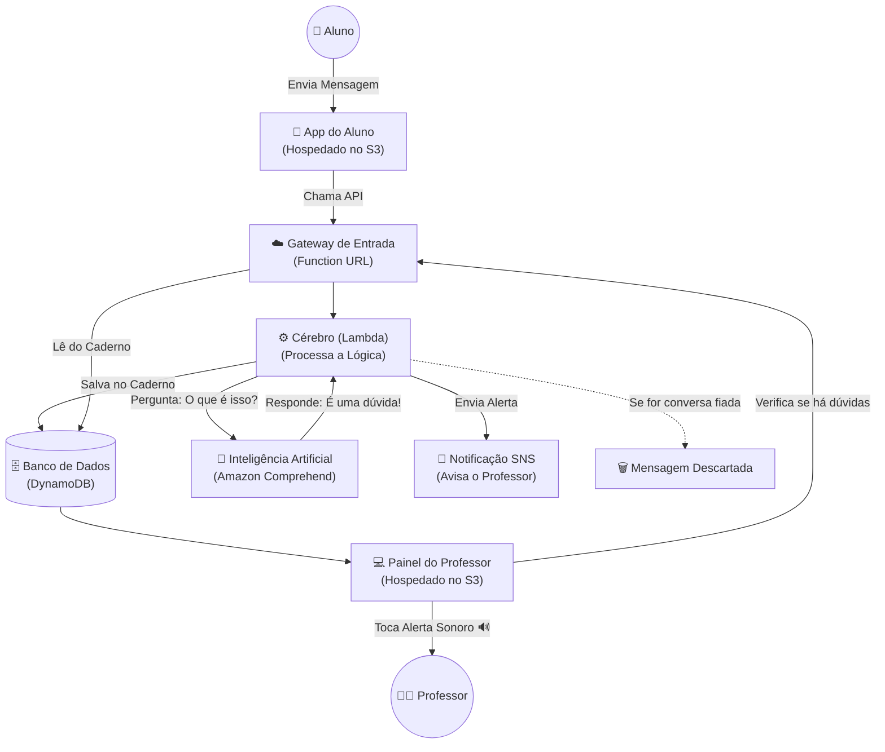

# 🎓 Smart Class Q&A

> **O que é este projeto?** Imagine uma sala de aula online onde os alunos enviam centenas de mensagens. O professor não consegue ler tudo. Nosso sistema funciona como um "filtro inteligente" que separa o que é dúvida do que é conversa, avisando o professor apenas quando ele realmente precisa intervir.

---

## 📖 Glossário para Iniciantes

Se você é novo na nuvem (Cloud), aqui estão os termos que usamos:
*   **Frontend**: As telas que o usuário vê (o site).
*   **Backend**: O "cérebro" que roda no servidor, longe dos olhos do usuário.
*   **AWS S3**: Uma pasta de arquivos na nuvem (onde guardamos o nosso site).
*   **AWS Lambda**: Uma função que "acorda", faz um trabalho rápido e "dorme". É barata e eficiente.
*   **DynamoDB**: Nosso caderno de anotações (Banco de Dados). É onde guardamos as dúvidas para sempre.
*   **Amazon Comprehend**: O serviço de inteligência que "lê" o texto e entende o sentimento.

---

## 🏗️ Arquitetura do Sistema

Aqui está como os componentes conversam entre si. O fluxo segue as setas:

---

## 🚀 Como este projeto ajuda?

1.  **Foco total**: O professor não se distrai com "Bom dia" ou "kkk".
2.  **Agilidade**: O alerta sonoro garante que a dúvida seja respondida na hora.
3.  **Organização**: Todas as dúvidas ficam salvas para consulta posterior.

---

## 🛠️ Próximos Passos
Para instalar o projeto, siga o guia em: [**DEPLOY.md**](DEPLOY.md)