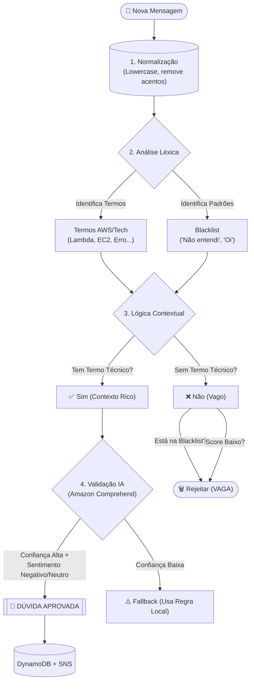

# 🧠 Algoritmo de Classificação (v2.0)

O coração do Smart Class Q&A é o seu sistema de classificação híbrido, que decide se uma mensagem é uma **DÚVIDA TÉCNICA** (que deve acordar o professor) ou uma **INTERAÇÃO SOCIAL** (que pode ser ignorada ou apenas logada).

A versão 2.0 introduz o conceito de "Contexto sobre Regra", onde a presença de termos técnicos pode anular regras de bloqueio simples.

---

## 🔬 O Fluxo de Decisão (Pipeline)

O sistema processa cada mensagem em etapas sequenciais:

---

## 📝 Detalhes das Camadas

### 1. Camada de Regras & Contexto
Diferente da versão anterior, a blacklist não é absoluta.
*   **Antes:** Se a mensagem continha "não entendi", era rejeitada (assumia-se vago).
*   **Agora:** 
    *   "Não entendi nada" -> **REJEITADA** (Está na blacklist E não tem termo técnico).
    *   "Não entendi o Comprehend" -> **APROVADA** (Termo técnico "Comprehend" anula a blacklist).

### 2. Vocabulário Expandido (`constants.js`)
O sistema agora reconhece mais de 50 termos técnicos, incluindo:
*   **Serviços de IA:** Comprehend, Rekognition, Polly, Bedrock.
*   **Infraestrutura:** EC2, Lambda, VPC, Subnet.
*   **Conceitos:** Erro, Log, Console, Tela, Configuração.

### 3. Validação de IA (Amazon Comprehend)
Se a mensagem passa pelas regras locais, ela é enriquecida pela IA da AWS:
*   **Sentimento:** Mensagens com sentimento `NEGATIVO` (frustração) ou `NEUTRO` (pergunta técnica direta) ganham pontos.
*   **Key Phrases:** A IA extrai entidades. Se a confiança da extração for alta, o score da mensagem sobe.

---

## 🔄 O Loop de Feedback (Aprendizado)

O sistema agora possui um mecanismo de correção humana:
1.  Se o classificador errar e marcar uma conversa como dúvida, ela aparece no dashboard.
2.  O professor clica no botão **"✕" (Falso Positivo)**.
3.  O sistema envia um evento para o endpoint `/feedback`.
4.  A mensagem é marcada no banco de dados com `correctClassification: 'INTERACAO'`.
5.  *(Futuro)* Esses dados serão usados para re-treinar o modelo ou ajustar os pesos do classificador automaticamente.

---

## 📊 Métricas de Decisão

O dashboard exibe em tempo real:
*   **Confiança Média:** Quão seguro o sistema está de suas classificações.
*   **Taxa de Fallback:** Quantas vezes o Amazon Comprehend falhou e o sistema teve que confiar apenas nas regras locais.
*   **Score de IA:** Uma pontuação de 0 a 100 calculada combinando Regras + Sentimento + Entidades.