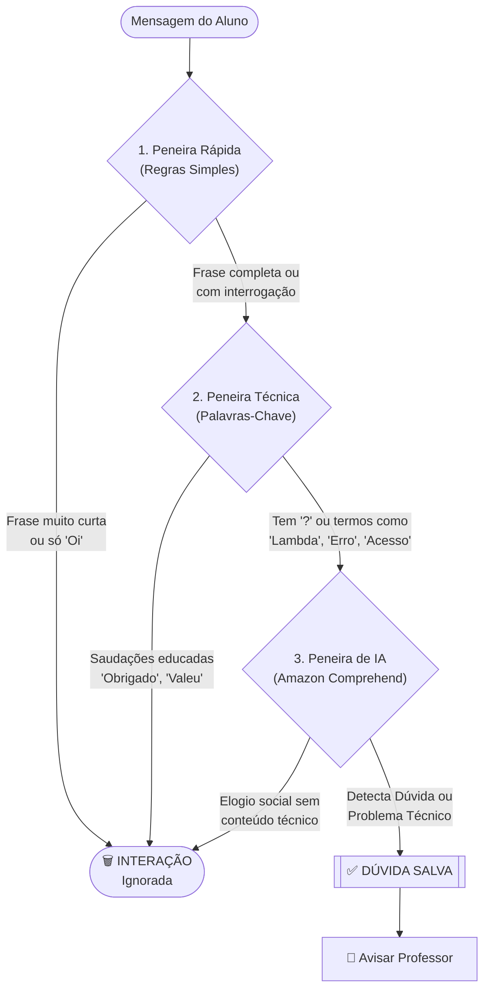

# 🧠 O Cérebro do Smart Class

Para saber se uma mensagem é importante, usamos uma "Peneira Inteligente" que funciona em três camadas. Se uma mensagem passar por todas, ela chega ao professor.

---

## 🔬 As 3 Camadas da Peneira

---

## 📝 O que cada camada faz?

### 1. Camada de Regras (O "Segurança")
Esta camada é a mais rápida. Ela olha o tamanho da frase. 
*   Se o aluno digitar apenas "Oi", o sistema já sabe que não é uma dúvida técnica e nem gasta tempo (ou dinheiro) chamando a Inteligência Artificial.

### 2. Camada Técnica (O "Especialista")
Aqui o sistema procura por palavras importantes da nossa aula, como:
*   **Serviços AWS**: Lambda, S3, EC2.
*   **Sinais de Dúvida**: "Como", "Porque", "Erro", "Não funciona".

### 3. Camada de IA (O "Mestre")
Esta é a parte mais avançada. Usamos o **Amazon Comprehend** para entender o *sentimento* da frase. 
*   Se o aluno estiver frustrado ("Não estou conseguindo acessar o link"), a IA detecta isso como algo urgente.
*   Se for apenas um elogio ("Aula top professor!"), a IA entende que é uma interação social e não interrompe o professor.

---

## 💡 Por que usamos IA se já temos regras?
As regras são ótimas para o óbvio, mas a IA é necessária para o **contexto**. 
Exemplo: "O S3 está dando erro" não tem um ponto de interrogação, mas é claramente uma dúvida/problema que o professor precisa saber. A IA consegue perceber isso!
