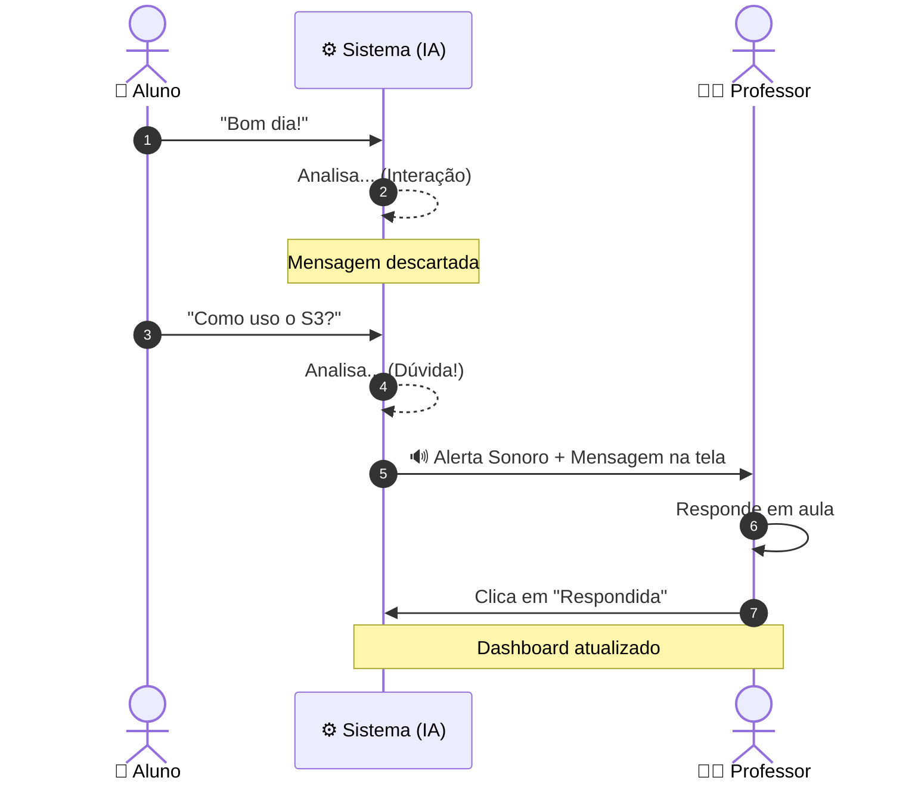

# 🎬 Roteiro de Demonstração

Use este roteiro para apresentar o projeto para colegas ou professores. O objetivo é mostrar a inteligência do sistema.

---

## 🎭 Preparação
1.  Abra a **Tela do Professor** em uma aba. Clique em **"Ativar Som"**.
2.  Abra a **Tela do Aluno** em outra aba (ou no celular).

---

## 🕹️ O Show (Passo a Passo)

### 1. Testando o Filtro de "Ruído" (Interação Social)
*   **Ação**: No site do Aluno, envie: *"Bom dia professor! Tudo bem?"*
*   **Resultado esperado**: 
    *   No Aluno: Aparece "Enviado".
    *   No Professor: **NADA acontece**. A lista continua vazia.
    *   **Explicação**: "Vejam que o sistema identificou que isso era apenas uma saudação social e não incomodou o professor."

### 2. Enviando uma Dúvida Real
*   **Ação**: No site do Aluno, envie: *"Professor, como eu faço o deploy da Lambda? Está dando erro de acesso."*
*   **Resultado esperado**:
    *   No Professor: **SOM DE ALERTA 🔊** e a dúvida aparece no topo da lista com uma borda amarela.
    *   Aparece a justificativa da IA: *"🤖 Conteúdo técnico detectado..."*
    *   **Explicação**: "Agora o sistema detectou uma dúvida técnica urgente, notificou o professor visualmente e sonoramente."

### 3. Respondendo a Dúvida
*   **Ação**: No painel do Professor, clique em **"Marcar como Respondida"**.
*   **Resultado esperado**: A dúvida fica com fundo verde e vai para o final da lista.
*   **Explicação**: "O professor consegue gerenciar o que já foi explicado, mantendo o foco no que ainda está pendente."

---

## 📈 Fluxo da Demo (Visual)

---

## 🎯 Conclusão da Demo
Destaque que o sistema economiza o tempo do professor e garante que nenhum aluno saia da aula com dúvidas, tudo isso usando tecnologias modernas de nuvem.
